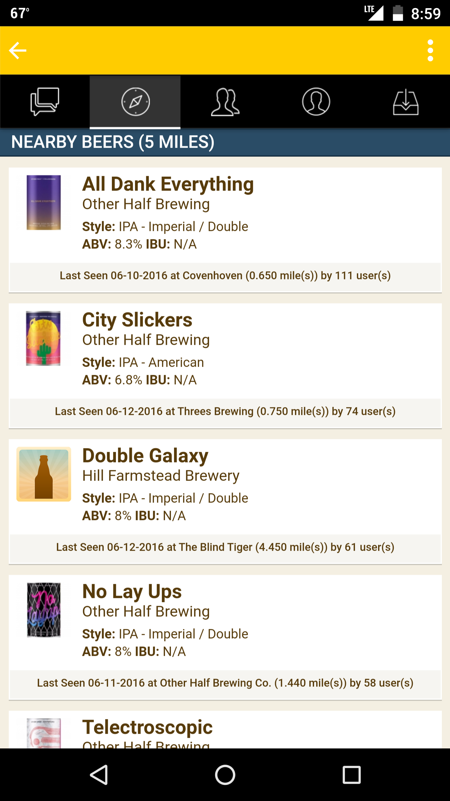

# Introduction

Untappt  is a web and mobile application that allows users to search for beers and rate the beer they are drinking. 

I'm not entirely sure how Untappt makes money, but I can guess that it is a combination of:
- subscription service:  where users can unlock additional functionality for a subscription. This is known as a 'freemium' model. 
  
- Advertising: I don't know if Untappt has ads, as I've never seen one on web or mobile, but the platform could have well-integrated programmatic advertising.    

Both of these business models rely on a loyal user base which frequently returns to the app.   
  
# Identifying target users
  
From the outside I believe the following personas represent target end-users:  
- "Beer-nerd": this is someone who loves beer. They read books and blogs about beer, travel to breweries on their vacations, know which local stores have the best selection. They home-brew. When you see them in any casual setting, they're wearing a brewery tee shirt and they'd choose death over Bud-lite. They have intense opinions about beer and the list of beers they've tasted numbers in the hundreds.  

- "Bored-with-lite": this is someone who likes beer well enough, but they don't know hops from barley and beer is still just a beverage to them. Maybe they got the impression it was lame to drink a Coors when that local IPA is available and now it's a habit to go off the beaten path a bit. They definitely don't like every beer they've ever tried (what's up with lambics?) and want to remember that nice Pilsner they had that one time. 
 
## Identifying the key goals of target end user

### Beer-nerd (BN)

The beer nerd (BN) user tries new beers whenever possible. The want a beer-tracking platform which is up to date, since new breweries and production runs of beer are created frequently. The beer nerd wants recommendations that will delight them - obscure, challenging, and sourced from breweries they may not already know about.  

The BN users can be challenged - if you constantly suggest beers that are too similar to things they've already tried, they may get bored and not return to the app. 

### Bored-with-lite (BWL)

The Bored-with-lite (BWL) user doesn't want to throw good money after bad when drinking a brew. They know they liked Goose Island IPA once and they want something a lot like next time the come to Untappt. If a beer too far afield from their taste is suggested, they may blame the app for the $12 beer that they didn't like and not return.   

If we model beers and breweries as a graph, BWL users should be shown nearby neighbors to the beers they've already tried, and suggested results should be relatively popular varieties.  

## How target end users can accomplish their goals

Untappt has 4.5 stars on the iTunes App Store with thousands of reviews, indicating their users are generally satisfied and accomplishing their goals. 

In the mobile app the primary recommendation function is the 'Nearby Beers' page. 'Nearby' indicates that the first filter for their recommendation engine is location. Since brewery distribution is highly regional, it is important to avoid recommending a beer that is unavailable in the user's area.  

To some extent the library of beers in Untappt is crowd-sourced. if you have a beer but cannot find it in Untappt you can submit it for inclusion. This relies on BN users to help ensure the app is as current as possible. Crowd sourcing has drawbacks - it can result in typos, double-entries, etc. therefore Untappt moderates user-added beers. 

## Reverse engineering Untappt

My assessment of the Untappt platform has lead me to believe the following methods are used in the recommendation engine:  
1) Geographic filtering by user location
2) Content-based recommendations - as seen in my screenshot above, most of the recommended beers come from a NYC brewery that I frequently log in Untappt called Other Half. I've tried several of their beers and rated them all high, so now Untappt is suggesting I try some of their newer brews. 

## Improving Untappt

I would improve the Untappt beer recommendations using collaborative filtering. A collaborative filtering system could match users with beers based on the likes of users which have a similar rating history. If there is a 'beer nerd' has a rating vector which is a short distance from mine, when that user rates a beer I haven't tried, the platform could recommend it to me on the guess that our tastes are very similar. 

In addition, knowlege based recommendations may be very useful for the BWL users. Untappt could use basic parameters such as alcohol by volume, bitterness units, and general popularity of beer types (i.e. pilsners over lambics) to improve recommendations for users who have not rated many beers. 

